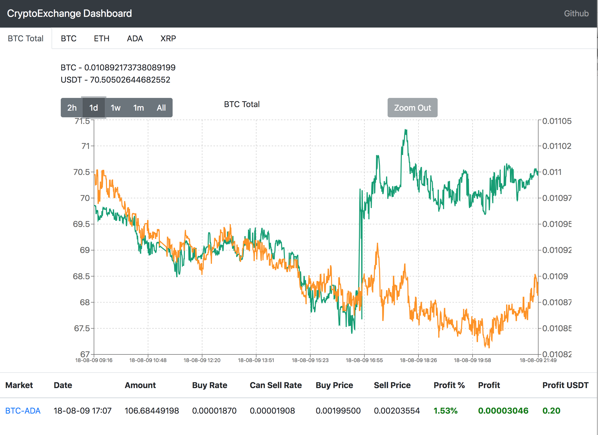

## cryptoexchange-dashboard

[](https://travis-ci.org/kataras/iris)

Primarily this project is my field for experiments in Go and its source code is slightly overloaded

The tool allows you to sync your data from cryptocurrency exchanges and see the progress in time on web UI. Currently, only Bittrex is supported

### How to run everything in one click

- Copy `docker/env.template` to `docker/env` and change it especially in the section commented by `###change me`

- Add your read-only Bittrex API keys `EXCHANGE_API_KEY`, `EXCHANGE_API_SECRET` to `docker/env` file or export them as environment variables. Your keys stay locally and won't be published somewhere outside of your environment. But anyway, **PLEASE GENERATE YOUR KEYS AS READONLY** - it is enough for work

- Run

    ```bash
    make docker-compose-x86 DCO_ARGS="up -d"
    ```

- Check that everything is OK

    ```bash
    make docker-compose-x86 DCO_ARGS="logs"
    
    ```
- Go to the [http://localhost](http://localhost) or use the custom port at the end of the URL if you have changed it in `docker/env` file

The web page doesn't look very nice but gives you helpful info

- aggregated history of all coins converted to BTC
- history of each coin in the separate tab
- orders history with the current profit info




### How to run synchronizer separately

Synchronizer is the part of all tools that syncs data from exchanges to the local database. To see results you should run web UI separately. Would be good to run synchronizer on the machine working without interruption, because you will lose the data in the time range when it is not online

- Prepare your `env` file as in the section above
    
- Run
    
    ```bash
    make docker-compose-x86 DCO_ARGS="up -d sync"
    ```

- Check that everything is OK

    ```bash
    make docker-compose-x86 DCO_ARGS="logs"
    
    ```

### How to run web UI separately

- Prepare your `env` file as in the section above

- Run

    ```bash
    make docker-compose-x86 DCO_ARGS="up -d web"
    ```

- Check that everything is OK

    ```bash
    make docker-compose-x86 DCO_ARGS="logs"
    
    ```

- Go to the [http://localhost](http://localhost) or use the custom port at the end of the URL if you have changed it in `docker/env` file

### ARM or Raspberry PI support

You can run Synchronizer or Web on your raspberry like device just using `make docker-compose-armhf` instead of `make docker-compose-x86`


### How to build docker images

```bash
make docker-build-x86
```

```bash
make docker-build-armhf
```